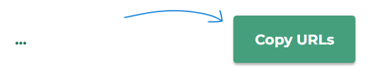

  

### **Copy all Chrome tab urls**

##### Have a bunch of tabs open and want to grab all the URLs without having to do it manually?

 

##### 1. Click the extension button

 

##### 2. Click the Copy URLs button

 

